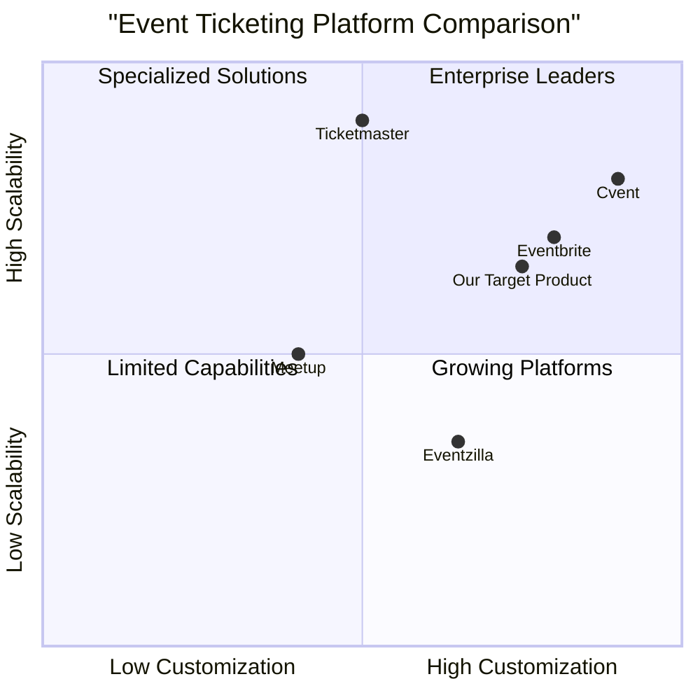

# Product Requirements Document: Event Ticket Booking System

## 1. Project Overview

### 1.1 Language & Project Information
- **Language**: English
- **Programming Languages**: ReactJS (Frontend), Spring Boot (Backend)
- **Project Name**: event_ticket_booking_system
- **Original Requirements**: Create a full stack event ticket booking system with ReactJS and Spring Boot supporting three user roles: admin, regular users, and organizers.

### 1.2 Executive Summary

The Event Ticket Booking System is a comprehensive platform that facilitates the creation, discovery, and booking of events. The system will provide different functionality for three distinct user roles: administrators, event organizers, and regular users (attendees). The platform aims to streamline the entire event lifecycle, from creation and promotion to ticket sales and attendance management.

## 2. Product Definition

### 2.1 Product Goals

1. **Streamline Event Management**: Provide a comprehensive solution for event organizers to create, manage, and promote their events efficiently.
2. **Enhance User Experience**: Deliver a seamless and intuitive booking experience for attendees, from event discovery to ticket acquisition and management.
3. **Maximize Revenue Potential**: Implement features that optimize ticket sales through dynamic pricing, targeted promotions, and comprehensive analytics.

### 2.2 User Stories

#### Admin User Stories
1. As an admin, I want to manage all users and events on the platform so that I can maintain system integrity and quality.
2. As an admin, I want to access comprehensive analytics across all events so that I can make data-driven decisions for platform improvements.
3. As an admin, I want to configure payment processing settings so that I can ensure proper financial transactions and revenue distribution.
4. As an admin, I want to manage content like terms of service and FAQs so that I can keep system information updated.

#### Organizer User Stories
1. As an organizer, I want to create and customize event pages so that I can effectively promote my events to potential attendees.
2. As an organizer, I want to set up different ticket types with various pricing options so that I can maximize revenue and attendance.
3. As an organizer, I want to access attendee information and event analytics so that I can track performance and plan future events.
4. As an organizer, I want to manage refunds and cancellations so that I can address attendee issues efficiently.

#### Regular User Stories
1. As a user, I want to discover events based on my interests, location, and availability so that I can find relevant events to attend.
2. As a user, I want to purchase tickets easily and securely so that I can attend events without complications.
3. As a user, I want to access my tickets digitally so that I can enter events conveniently.
4. As a user, I want to receive notifications about upcoming events and changes so that I stay informed about events I'm interested in.

### 2.3 Competitive Analysis

| Platform | Pros | Cons |
|----------|------|------|
| Eventbrite | - Comprehensive feature set - Strong brand recognition - Extensive integrations - Mobile apps | - Higher fees for organizers - Limited customization for smaller events - Complex UI for new users |
| Ticketmaster | - Massive reach and distribution - Advanced fraud protection - High-volume processing capability | - High service fees - Limited options for smaller events - Less organizer control |
| Meetup | - Community-focused - Recurring event support - Built-in promotion features | - Limited ticket types - Basic analytics - Subscription model for organizers |
| Eventzilla | - Affordable pricing - Good customization options - White-labeling available | - Less brand recognition - Fewer integrations - Basic mobile experience |
| Cvent | - Enterprise-grade features - Comprehensive reporting - Advanced marketing tools | - Complex setup process - Higher cost - Steep learning curve |
| Our Solution | - Custom role-based access - Integrated Spring Boot backend - Modern React frontend - Developer-friendly architecture | - New market entrant - Building user base - Limited initial integrations |

### 2.4 Competitive Quadrant Chart

## 3. Technical Specifications

### 3.1 System Architecture

#### Frontend (ReactJS)
- **Key Technologies**: React 18, Redux for state management, React Router for navigation, Axios for API calls, Tailwind CSS for styling
- **Key Features**: Responsive design, real-time updates, optimized performance

#### Backend (Spring Boot)
- **Key Technologies**: Spring Boot 3.x, Spring Security, Spring Data JPA, PostgreSQL, Redis for caching
- **Key Components**: 
  - Microservices architecture with specialized services
  - RESTful API endpoints
  - JWT for authentication
  - WebSocket for real-time updates

### 3.2 Data Model

The system will include the following core entities:

1. **User**
   - UserID (PK)
   - Email
   - Password (hashed)
   - First Name
   - Last Name
   - Role (Admin, Organizer, Regular)
   - Contact Information
   - Registration Date

2. **Event**
   - EventID (PK)
   - OrganizerID (FK)
   - Title
   - Description
   - Start Date/Time
   - End Date/Time
   - Location (physical or virtual)
   - Category
   - Status
   - Created Date
   - Modified Date

3. **Ticket Type**
   - TicketTypeID (PK)
   - EventID (FK)
   - Name
   - Description
   - Price
   - Quantity Available
   - Sale Start Date/Time
   - Sale End Date/Time
   - Max Tickets Per User

4. **Ticket**
   - TicketID (PK)
   - TicketTypeID (FK)
   - UserID (FK)
   - OrderID (FK)
   - Status
   - Purchase Date/Time
   - QR Code/Barcode Data

5. **Order**
   - OrderID (PK)
   - UserID (FK)
   - Total Amount
   - Payment Status
   - Transaction ID
   - Purchase Date/Time

### 3.3 Requirements Analysis

The Event Ticket Booking System requires a robust architecture to handle the following key technical challenges:

1. **Concurrency and Race Conditions**: Multiple users attempting to book the same tickets simultaneously
2. **Payment Processing**: Secure handling of financial transactions
3. **Scalability**: Handling traffic spikes during popular event sales
4. **Security**: Protecting user data and preventing fraud
5. **Real-time Updates**: Providing immediate feedback on ticket availability

### 3.4 Requirements Pool

#### P0 (Must-Have)
1. User authentication and role-based access control
2. Event creation and management
3. Ticket type configuration
4. Ticket purchasing workflow
5. Basic reporting for organizers and admins
6. Mobile-responsive design
7. Digital ticket generation and validation
8. Payment processing

#### P1 (Should-Have)
1. Search and filtering capabilities
2. User profiles and preferences
3. Event analytics dashboard
4. Notification system (email and in-app)
5. Refund processing
6. Social sharing integration
7. Event categories and tagging

#### P2 (Nice-to-Have)
1. Dynamic pricing based on demand
2. Seat selection for reserved seating events
3. Waitlist functionality
4. Promotional code support
5. Bundled ticket packages
6. Integration with calendar applications
7. Advanced analytics and forecasting

### 3.5 UI Design Draft

#### 3.5.1 Key Pages

1. **Home Page**
   - Featured events section
   - Category-based browsing
   - Search functionality
   - Personalized recommendations (for logged-in users)

2. **Event Details Page**
   - Event information (name, description, date, location)
   - Ticket availability and pricing
   - Purchase options
   - Organizer information
   - Related events

3. **Ticket Purchase Flow**
   - Ticket selection
   - Attendee information collection
   - Payment processing
   - Confirmation and receipt

4. **User Dashboard**
   - Upcoming events
   - Past events
   - Ticket management
   - Profile settings

5. **Organizer Dashboard**
   - Event creation and management
   - Ticket type configuration
   - Attendee management
   - Sales and analytics

6. **Admin Dashboard**
   - Platform-wide analytics
   - User management
   - Event oversight
   - System configuration

#### 3.5.2 Navigation Structure

**Public Navigation:**
- Home
- Discover Events
- Categories
- Login/Signup

**User Navigation (when logged in):**
- Home
- Discover Events
- My Tickets
- Profile

**Organizer Navigation (additional):**
- My Events
- Create Event
- Analytics

**Admin Navigation (additional):**
- Dashboard
- Users
- All Events
- System Settings

### 3.6 API Endpoints

#### Authentication API
- POST /api/auth/register
- POST /api/auth/login
- POST /api/auth/refresh-token
- POST /api/auth/logout

#### User API
- GET /api/users/{id}
- PUT /api/users/{id}
- GET /api/users/{id}/tickets
- GET /api/users/{id}/events (for organizers)

#### Event API
- GET /api/events
- POST /api/events
- GET /api/events/{id}
- PUT /api/events/{id}
- DELETE /api/events/{id}
- GET /api/events/{id}/tickets

#### Ticket API
- POST /api/tickets/purchase
- GET /api/tickets/{id}
- PUT /api/tickets/{id}/cancel
- GET /api/tickets/{id}/validate

#### Admin API
- GET /api/admin/users
- PUT /api/admin/users/{id}/role
- GET /api/admin/events
- GET /api/admin/analytics

### 3.7 Open Questions

1. **Payment Gateway Integration**: Which payment processors should be supported initially?
2. **Scalability Strategy**: How will the system handle high-traffic events like popular concert ticket sales?
3. **Fraud Prevention**: What mechanisms will be implemented to prevent ticket scalping and fraud?
4. **Legal Compliance**: What regional legal requirements need to be considered for ticket sales and refunds?
5. **Internationalization**: Will the platform support multiple languages and currencies?

## 4. Implementation Timeline

### Phase 1 (8 weeks)
- User authentication system
- Basic event creation and management
- Simple ticket purchasing workflow
- Core admin functionality

### Phase 2 (6 weeks)
- Enhanced event discovery features
- Advanced ticket types and pricing
- Reporting and analytics
- Notification system

### Phase 3 (4 weeks)
- Mobile optimization
- Social sharing
- Additional payment methods
- Performance optimization

## 5. Success Metrics

### 5.1 Key Performance Indicators

1. **User Adoption**
   - Number of registered users
   - User growth rate
   - Active users per month

2. **Engagement**
   - Events created per month
   - Tickets sold per event
   - Return rate for users and organizers

3. **Financial**
   - Gross merchandise value
   - Revenue from ticket fees
   - Conversion rate (views to purchases)

4. **Technical**
   - System uptime
   - Page load times
   - Error rates

### 5.2 Evaluation Criteria

The system will be considered successful if:

1. User adoption increases by 15% month-over-month in the first 6 months
2. At least 80% of users rate the platform 4+ stars for ease of use
3. Organizers report at least 20% efficiency improvement compared to previous solutions
4. System handles peak loads without degradation in performance

## 6. Conclusion

The Event Ticket Booking System provides a comprehensive solution for event management and ticketing. By addressing the needs of all three user types (admins, organizers, and regular users), the platform aims to deliver a seamless experience throughout the event lifecycle.

The system's modern architecture using ReactJS and Spring Boot ensures a responsive, scalable, and secure platform capable of handling various event types and sizes. With the outlined features and implementation plan, the platform is positioned to compete effectively in the event ticketing market.